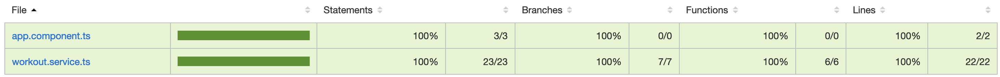
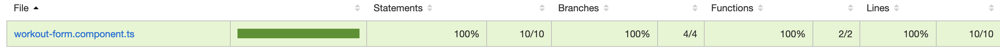

# Workout Tracker

This project allows user to track workout duration in the forms of tables and charts. This project is built using Angular 18.1.4.

## Assignment's solution details

-> Framework - Angular 18.1.4 <br />
-> It's a SPA that takes inputs like name, workout type and duration (in Minutes). The user details are showing in the form of tables. <br />
-> When clicking on any user we can see the progress chart for that user. <br />
-> It also have a feature of searching by name and filter for workout type. <br />

## Hosting details

Hosted on Github pages - https://vish-27.github.io/workout-tracker/

## Bonus Feature

Added chart using chart.js package. <br />
When clicking on any user this feature displayes charts of that user and the duration of workout.

## Test Coverage

This project includes unit tests for one component and one service with 100% code coverage. 

### Coverage Summary

 <br />
 <br />

You can view the full code coverage report by running the following command and opening the `index.html` file located in the `coverage/` directory:
```bash
ng test --code-coverage

## Development server

Run `ng serve` for a dev server. Navigate to `http://localhost:4200/`. The application will automatically reload if you change any of the source files.


## Running unit tests

Run `ng test` to execute the unit tests via [Karma](https://karma-runner.github.io).
